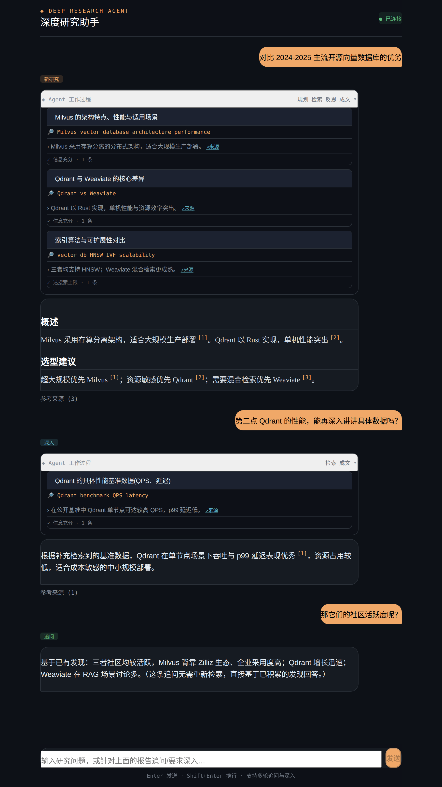

# Deep Research Agent（深度研究 Agent）

一个采用 **规划-执行-反思（Plan–Execute–Reflect）** 架构的自主研究 Agent。给它一个开放式研究问题，它会自动把问题拆解成子问题、联网搜索、抓取并定向摘要网页、反思信息是否充分、必要时补充检索，最终产出一份**带可溯源引用**的结构化研究报告。

> 本项目的设计目标不是"又一个 LangChain demo"，而是一个**经得起工程追问**的 Agent：有明确的失败模式处理、有防死循环机制、有成本优化、有可量化的评估体系。



## 它解决什么问题

给定问题 → 自主研究 → 输出带引用的报告：

```
输入："对比 2024-2025 年主流开源向量数据库的优劣"
输出：一份分点论述的报告，每个关键论断后标注 [n]，末尾附真实来源 URL 列表
```

## 核心特性

- **规划-执行-反思循环**：先把问题拆成子问题，逐个研究，再做全局反思补缺，最后写作。相比朴素 ReAct 单循环，在开放式研究任务上更稳、更不易跑偏。
- **两道防死循环防线**：每个子问题有搜索次数硬上限；全局补充子问题数量也有上限。保证流程一定终止、总成本有上界。
- **模型分级（成本优化）**：高频的网页摘要用便宜的小模型（FAST 档），低频高难的规划/写作用强模型（SMART 档）。避免"每一步都用最贵模型"的浪费。
- **可溯源引用（防幻觉）**：报告里的每个引用都指向一个**真实抓取过**的网页 URL，而非模型编造的链接。
- **优雅降级**：搜索/抓取失败时返回空结果而非崩溃，让 Agent 把对应子问题标记为信息不足并继续。
- **可量化评估体系**：内置 eval 框架，度量引用准确率、覆盖度、token 成本，支持参数对比实验。
- **零门槛可验证**：默认搜索用 DuckDuckGo（无需 key）；核心控制流有 mock 测试，无需 API key、不联网即可 `pytest` 验证逻辑。
- **多轮研究对话界面**：React 聊天界面（CDN 零构建）+ FastAPI/WebSocket 后端。不止"问一次得一份报告"——出报告后可继续追问、要求深入某点、补充新角度。核心是**意图分类**：追问直接用已积累发现回答（省钱），要深入才触发定向检索。会话通过 SQLite 持久化。表现层与核心逻辑解耦，CLI 与 Web 共用同一套 Agent。

## 架构

```
                          ┌──────────────┐
   研究问题  ───────────▶ │   规划器      │  拆成 3-5 个子问题
                          └──────┬───────┘
                                 │
                 ┌───────────────▼────────────────┐
                 │  对每个子问题（内循环）           │
                 │  ┌────────────────────────────┐ │
                 │  │ 改写查询 → 搜索 → 抓取+摘要  │ │
                 │  │        ↓                    │ │
                 │  │      反思：信息够了吗？      │ │ ◀── 防死循环：
                 │  │   够 → 退出 / 不够 → 再来    │ │     次数硬上限
                 │  └────────────────────────────┘ │
                 └───────────────┬────────────────┘
                                 │
                          ┌──────▼───────┐
                          │  全局反思     │  还有缺口？→ 补充子问题
                          └──────┬───────┘
                                 │
                          ┌──────▼───────┐
                          │  报告生成     │  带引用 + 真实来源列表
                          └──────────────┘
```

详细设计与权衡见 [docs/DESIGN.md](docs/DESIGN.md)。

## 项目结构

```
deep_research/
├── llm/client.py        # LLM 客户端层：模型分级、JSON 解析、token 计数、重试
├── tools/
│   ├── search.py        # 搜索工具（DuckDuckGo，可替换）
│   └── fetch.py         # 网页抓取 + 定向摘要（成本优化核心）
├── agent/
│   ├── state.py         # 结构化状态对象（而非膨胀 prompt）
│   ├── steps.py         # 五个推理步骤：规划/改写/反思/全局反思/写作
│   └── agent.py         # 主控制循环（规划-执行-反思）
├── eval/evaluator.py    # 评估框架：引用准确率/覆盖度/成本
└── __main__.py          # 命令行入口

eval/
├── dataset/research_questions.json   # 评估数据集（问题 + 预期关键点）
└── run_eval.py                       # 评估运行脚本

web/                     # 多轮研究对话界面（表现层，不含业务逻辑）
├── server.py            # FastAPI + WebSocket：双向通信，事件实时推送
└── static/index.html    # React 聊天界面（CDN 零构建）

deep_research/agent/
├── conversation.py      # 会话层：意图路由 + 跨轮发现复用 + SQLite 持久化
└── intent.py            # 意图分类：NEW_RESEARCH/DEEPEN/FOLLOW_UP/REFINE

tests/
├── test_agent.py        # 核心控制流（无需 key/联网）
├── test_conversation.py # 会话层：意图路由、发现复用、持久化
└── test_web.py          # WebSocket 多轮对话链路
docs/                    # 设计文档
```

## 快速开始

```bash
# 1. 安装依赖
pip install -r requirements.txt

# 2. 配置（复制样例并填入你的 key）
cp .env.example .env
export OPENAI_API_KEY=sk-...        # 或在 .env 里填好

# 3. 运行一次研究（命令行）
python -m deep_research "对比 2024-2025 年主流开源向量数据库的优劣"

# 4. 启动 Web 界面（推荐：多轮研究对话，可追问/深入）
uvicorn web.server:app --reload --port 8000
# 然后浏览器打开 http://localhost:8000
# 先问一个研究问题出报告，再继续追问、要求深入某点、或补充新角度

# 5. 调参运行
python -m deep_research "你的问题" --max-subq 4 --max-search 2 --top-k 3

# 6. 跑评估
python eval/run_eval.py --limit 2          # 先跑 2 个用例省钱调试

# 7. 跑测试（无需 key、不联网，含核心逻辑 + Web 链路）
pytest tests/ -v
```

### 换用其它模型

代码基于 OpenAI 兼容接口。换模型只需改环境变量，无需动业务代码：

| 目标 | 设置 |
| --- | --- |
| OpenAI 官方 | 只设 `OPENAI_API_KEY` |
| 本地 Ollama | `OPENAI_BASE_URL=http://localhost:11434/v1`，`SMART_MODEL`/`FAST_MODEL` 设为本地模型名 |
| 其它兼容服务 | 设 `OPENAI_BASE_URL` 指向对应端点 |

## 可调参数（"旋钮"）

| 参数 | 含义 | 权衡 |
| --- | --- | --- |
| `max_subquestions` | 子问题数量上限 | 多→覆盖广但贵；少→省钱但可能漏 |
| `max_searches_per_subq` | 单子问题搜索次数上限 | 质量 vs 成本，也是防死循环硬上限 |
| `results_per_search` | 每次搜索抓取条数 | 召回 vs 成本 |
| `default_temperature` | 采样温度 | 规划/反思用低温保稳定 |

## 评估指标

| 指标 | 怎么算 | 说明 |
| --- | --- | --- |
| 引用准确率 | 程序校验报告中 `[n]` 是否在合法范围 | 零成本、确定性，防编造引用 |
| 覆盖度 | LLM-as-judge 对照预设关键点 | 有偏差，理想需人工校准 |
| token 成本 | 累计 prompt + completion token | 成本可观测性 |

## 已知局限与改进方向

- 子问题目前**串行**执行，延迟较高 → 可改为并行（注意搜索 API 速率限制）。
- 覆盖度评估依赖 LLM-as-judge，存在偏差 → 引入人工标注校准。
- DuckDuckGo 免费但结果质量/稳定性有限 → 生产环境可换 Tavily/SerpAPI（接口已抽象，可插拔）。
- 未做长期记忆（任务是单次研究，收益不大）→ 若要做多轮连续研究可加入向量记忆。

## 文档导航

- [docs/DESIGN.md](docs/DESIGN.md) — 详细架构与设计权衡
- [docs/WEB_ARCHITECTURE.md](docs/WEB_ARCHITECTURE.md) — Web 界面分层与实时通信选型
- [examples/sample_run.md](examples/sample_run.md) — 示例运行输出与产出形态
